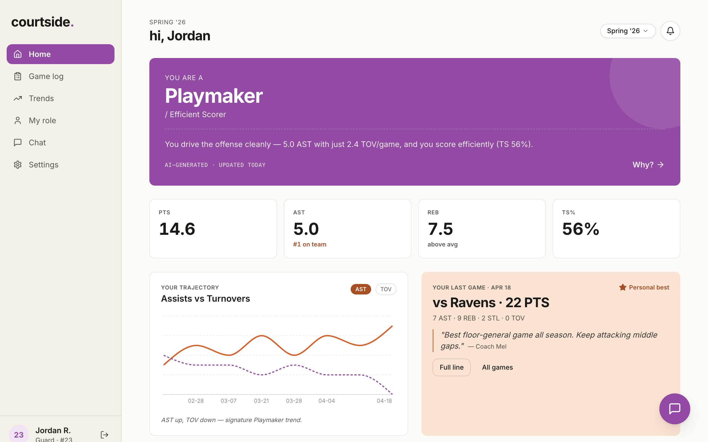
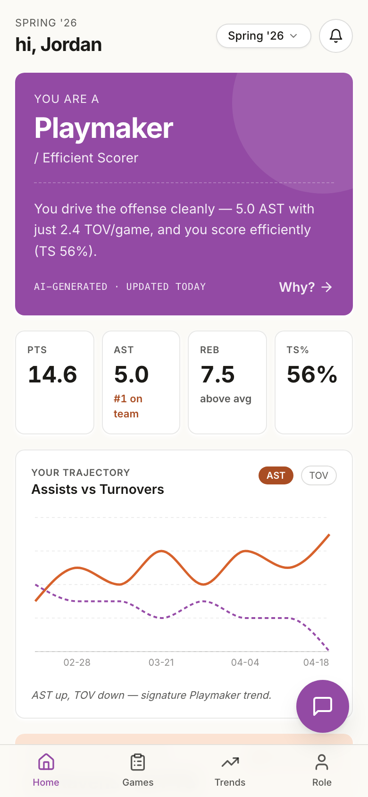
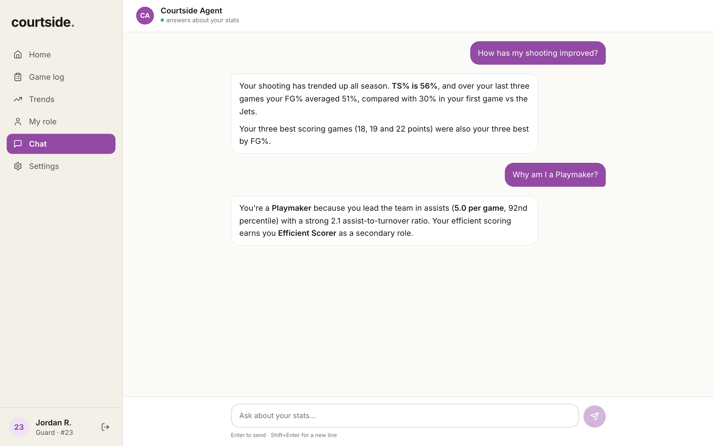
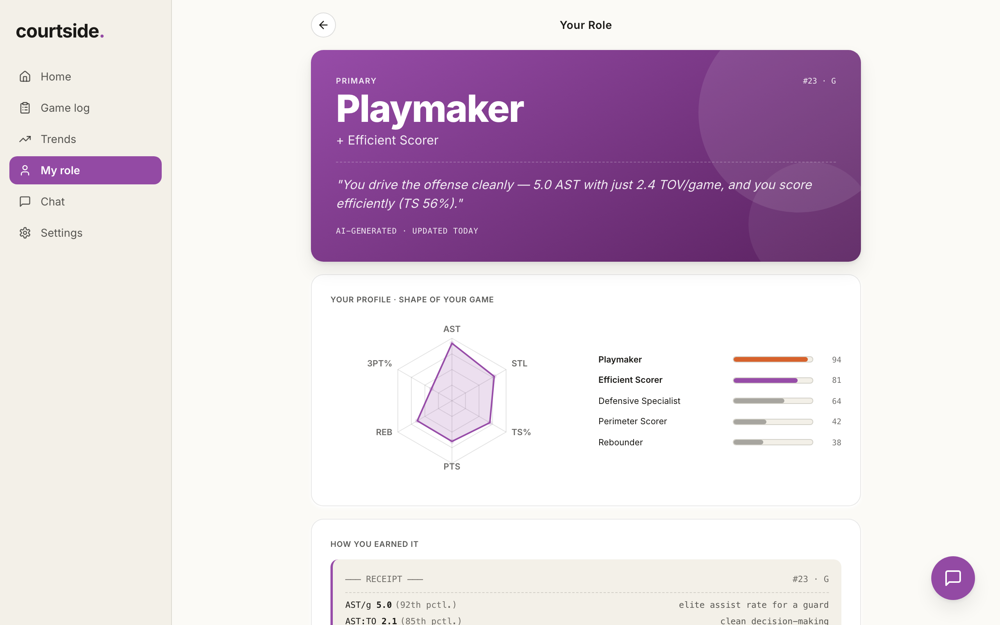

# Courtside

[](https://github.com/ngterzis/courtside/actions/workflows/ci.yml)

Player-facing web app for a rec-league basketball league. Players sign in, check their
stats, understand their AI-assigned **archetype** (Playmaker, Efficient Scorer, Glass
Cleaner, …), track progress across a season, browse their game log, and chat with an AI
about their own game.

<p>
  
  
</p>

## Demo

[](https://youtu.be/d4UmFKxlz5Y)

**Run it locally without a backend.** Mock mode serves the whole API, including a streamed
chat reply, from `src/mocks`:

```bash
nvm use            # Node 22
npm install
npm run dev:mock   # http://localhost:5173 — sign in with any email and password
```

<p>
  
  
</p>

## Stack

| Concern                | Library                                                  |
| ---------------------- | -------------------------------------------------------- |
| Build                  | Vite 5                                                   |
| Framework              | React 18 + TypeScript (strict)                           |
| Routing                | React Router v6, route-level code splitting              |
| Server state           | TanStack Query v5                                        |
| Styling                | Tailwind CSS v3                                          |
| Primitives             | shadcn/ui style (Radix Slot + CVA), copy-paste not a lib |
| Charts                 | Recharts                                                 |
| Icons                  | Lucide                                                   |
| API mocking            | MSW (mock mode) + Playwright request routing (E2E)       |
| Linting & formatting   | ESLint (typescript-eslint, react-hooks) + Prettier       |
| Unit & component tests | Vitest + React Testing Library                           |
| End-to-end tests       | Playwright + axe-core                                    |

## Design decisions

**Streaming chat over SSE, read with `fetch`.** Replies stream in as the model generates
them, instead of arriving all at once after a long wait. SSE is enough because data only
flows server → client during a reply, so WebSockets would add connection state for no
benefit. The browser's `EventSource` can't send a POST body or an `Authorization` header,
so the stream is read from a `fetch` response by a small parser (`src/lib/sse.ts`) that
handles events and multi-byte characters split across network reads.

**Stateless chat backend.** The client sends the conversation history with each message,
and the server adds the player's stats from the database before calling the model. The
server never trusts stats sent by the client and needs no session storage.

**Server state lives in TanStack Query, not a global store.** Every endpoint has one typed
hook in `src/lib/queries.ts`. Caching, deduplication and loading states come from the
library, so there's no hand-written client store to keep in sync with the API.

**The backend owns derived stats.** Shooting percentages and True Shooting % come from the
API. `src/lib/stats.ts` computes them only as a fallback when a field is missing.

**One mock backend, three uses.** `src/mocks/api.ts` describes every endpoint as plain
data. MSW serves it in the browser for `npm run dev:mock`, Playwright serves it to the E2E
and accessibility tests, and a unit test checks it covers every endpoint the app calls.

**Token in `localStorage`, knowingly.** The JWT is stored in `localStorage` and sent as a
Bearer token, which keeps the static S3/CloudFront deployment simple. The tradeoff is that
any XSS could read the token. For a production app with real users, I would move to an
`httpOnly`, `SameSite` cookie set by the API, which needs the frontend and API on the same
site.

## Getting started

Requires Node 22 or later (`.nvmrc` is provided, so `nvm use` picks it up).

```bash
npm install
npm run dev        # http://localhost:5173, proxies /api to http://localhost:8000
npm run dev:mock   # same app with the mock API, no backend needed
```

The API contract the frontend expects lives in [`docs/BACKEND.md`](./docs/BACKEND.md). It's
the single source of truth for endpoints and JSON shapes.

### Commands

```bash
npm run dev          # Vite dev server against the real API
npm run dev:mock     # Vite dev server with the mock API
npm run build        # typecheck + production build
npm run preview      # serve the production build
npm run typecheck    # tsc -b --noEmit
npm run lint         # ESLint
npm run format       # Prettier (format:check to verify only)
npm test             # unit + component tests (Vitest)
npm run test:watch   # Vitest in watch mode
npm run test:e2e     # E2E + accessibility tests (Playwright; builds the app first)
npm run screenshots  # regenerate the README screenshots
```

## Testing

Tests focus on the logic most likely to break silently, not on layout:

| Layer         | What's covered                                                                                                                             | Where                                   |
| ------------- | ------------------------------------------------------------------------------------------------------------------------------------------ | --------------------------------------- |
| Unit          | SSE stream parsing: events split across network reads, multi-byte characters split mid-byte, `[DONE]`, malformed events, reader cleanup    | `src/lib/sse.test.ts`                   |
| Unit          | Shooting percentages and True Shooting % formulas, including zero-attempt edge cases                                                       | `src/lib/stats.test.ts`                 |
| Unit          | `apiFetch`: bearer token, 401 → sign out + redirect, error messages                                                                        | `src/lib/api.test.ts`                   |
| Unit          | Mock API covers every endpoint the app calls                                                                                               | `src/mocks/api.test.ts`                 |
| Component     | Chat: thinking indicator, incremental streaming into rendered markdown, conversation history sent to the API, error and empty-reply states | `src/routes/chat.test.tsx`              |
| Component     | Error boundary shows a recovery screen and clears on navigation                                                                            | `src/components/ErrorBoundary.test.tsx` |
| End-to-end    | Sign in → dashboard → ask the chat agent a question → follow-up                                                                            | `e2e/chat.spec.ts`                      |
| Accessibility | axe-core scan against WCAG 2.1 A/AA on the login page and seven app screens                                                                | `e2e/accessibility.spec.ts`             |

E2E and accessibility tests run on desktop and mobile viewports against the production
build, with the API served from the shared mock (`e2e/mock-api.ts`). Charts and purely
visual components are deliberately left untested: they change often and are better
checked by eye.

First-time E2E setup: `npx playwright install chromium`.

**CI** (`.github/workflows/ci.yml`) runs lint, format check, typecheck, unit/component
tests and E2E tests on every pull request and push to `main`. Deploys only run once CI
passes.

## How it works

- **Auth** — JWT sent as a Bearer token on every request (`src/lib/auth.ts`,
  `src/lib/api.ts`). A `401` clears the token and redirects to `/login`.
- **Route guards** (`src/App.tsx`) — `RequireAuth` gates the app, `RedirectIfAuthed` bounces
  logged-in users away from `/login`, and `RequireOnboarded` sends players with no
  `onboardedAt` to `/onboarding`.
- **Loading and errors** — each screen is a lazy-loaded chunk. `RouteBoundary` shows a
  loader while it downloads and a recovery screen if it crashes, while the navigation
  stays usable.
- **Data** — every screen pulls from typed query hooks in `src/lib/queries.ts`
  (`useMe`, `useArchetype`, `useGames`, `useSeasonAverages`, `useTeamRanks`, `useLastGame`, …).
- **Chat** — `/chat` streams responses over SSE from `POST /api/chat`
  (`src/routes/chat.tsx`, parser in `src/lib/sse.ts`).

## Routes

| Route                | Screen                                                          |
| -------------------- | --------------------------------------------------------------- |
| `/`                  | Dashboard — archetype hero, stat strip, last game, trend charts |
| `/login`             | Email/password sign-in                                          |
| `/onboarding`        | Jersey number + position setup (first login)                    |
| `/archetype`         | Archetype detail — radar chart, fit scores, receipt explanation |
| `/archetype/history` | Archetype across seasons                                        |
| `/games`             | Game log — card list on mobile, table on desktop                |
| `/games/:gameId`     | Single-game box score + coach note                              |
| `/trends`            | PTS / TS% / AST–TOV / REB trend charts                          |
| `/chat`              | AI chat about the player's stats (SSE streaming)                |
| `/notifications`     | Personal bests, stats-ready, coach notes, weekly summary        |
| `/settings`          | Account + sign out                                              |

Unknown paths redirect to `/`.

## Project layout

```
src/
├── main.tsx                  # ReactDOM root; starts the mock API in mock mode
├── App.tsx                   # QueryClient + lazy route tree + auth/onboarding guards
├── index.css                 # Tailwind base/components/utilities
│
├── routes/                   # one file per screen (folder for nested routes)
│
├── components/
│   ├── layout/
│   │   ├── AppLayout.tsx      # Sidebar + page + BottomNav + ChatFab
│   │   ├── AuthLayout.tsx     # centered card shell for login/onboarding
│   │   └── RouteBoundary.tsx  # Suspense + error boundary around each page
│   ├── ui/                    # shadcn-style primitives (button, card)
│   ├── ErrorBoundary.tsx      # recovery screen for render errors
│   ├── PageLoader.tsx         # loading state while a page chunk downloads
│   ├── Sidebar.tsx            # desktop nav (lg+)
│   ├── BottomNav.tsx          # mobile nav (4 tabs)
│   ├── ChatFab.tsx            # persistent FAB; hidden on /chat
│   ├── ArchetypeHero.tsx      # purple hero card → /archetype
│   ├── StatCard.tsx           # label / value / delta
│   ├── RadarChart.tsx         # team-rank radar for archetype detail
│   ├── TrendChart.tsx         # single-metric line + rolling average
│   ├── DualTrendChart.tsx     # two-metric overlay (AST vs TOV)
│   ├── LastGameCard.tsx       # last-game card with coach note
│   ├── JerseyAvatar.tsx       # circle with jersey number
│   └── SeasonChip.tsx         # season switcher
│
├── lib/
│   ├── api.ts                # apiFetch — Bearer auth, 401 handling, ApiError
│   ├── auth.ts               # token get/set/clear in localStorage
│   ├── queries.ts            # typed TanStack Query hooks (one per endpoint)
│   ├── sse.ts                # readSSE — parses the chat event stream
│   ├── stats.ts              # fgPct / threePct / ftPct / tsPct fallbacks
│   └── utils.ts              # cn() — clsx + tailwind-merge
│
├── mocks/
│   ├── fixtures.ts           # sample player, season, games, notifications
│   ├── api.ts                # mock backend: endpoint table + canned chat replies
│   └── browser.ts            # MSW worker for npm run dev:mock
├── test/                     # Vitest setup + stream helpers
└── types/index.ts            # Player, Season, Game, GameStats, Archetype, …

e2e/                          # Playwright E2E, accessibility and screenshot specs
docs/
├── BACKEND.md                # API contract the frontend expects
├── design-handoff/           # product spec + wireframes
└── screenshots/              # README images (npm run screenshots)
```

Unit and component tests sit next to the code they cover (`*.test.ts[x]`).

## Design tokens

Tokens from the design handoff are baked into `tailwind.config.js`:

- `bg-primary` `#934aa4` — archetype hero, active nav, primary CTAs
- `bg-primary-soft` `#f0e3f3` — chip backgrounds
- `bg-accent` `#a94d23` — personal bests, accent CTAs
- `bg-accent-soft` `#fbe3d3` — last-game card background
- `text-ink` `#1b1a17` + `text-ink-70/50/30/15` — text hierarchy
- `bg-paper` `#fbfaf6` — page background
- `bg-paper-deep` `#f3f0e8` — sidebar / card alt
- `shadow-card` / `shadow-raised` — resting and lifted cards

Primary and accent are slightly darker than in the design handoff (`#974ca8`, `#d7622c`)
so text meets WCAG AA contrast. Charts keep the original hues.

## Deployment

Pushes to `main` trigger `.github/workflows/deploy.yml`: run the CI workflow, then build,
sync `dist/` to S3 and invalidate CloudFront (AWS auth via OIDC). Requires the
`AWS_FRONTEND_ROLE_ARN`, `S3_BUCKET`, and `CLOUDFRONT_DISTRIBUTION_ID` repo secrets.

## Related repos

Courtside is split across three repositories:

- **[courtside](https://github.com/ngterzis/courtside)** — this repo; the React + TypeScript frontend.
- **[courtside-backend](https://github.com/ngterzis/courtside-backend)** — API implementing the [`BACKEND.md`](./docs/BACKEND.md) contract.
- **[courtside-infra](https://github.com/ngterzis/courtside-infra)** — infrastructure / deployment (AWS).

## Related docs

- [`docs/BACKEND.md`](./docs/BACKEND.md) — API contract, data models, auth, chat SSE format.
- [`docs/design-handoff/README.md`](./docs/design-handoff/README.md) — product spec and wireframes.

## License

Released under the [GNU AGPLv3 License](./LICENSE).
